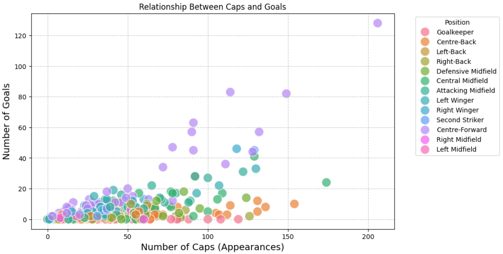
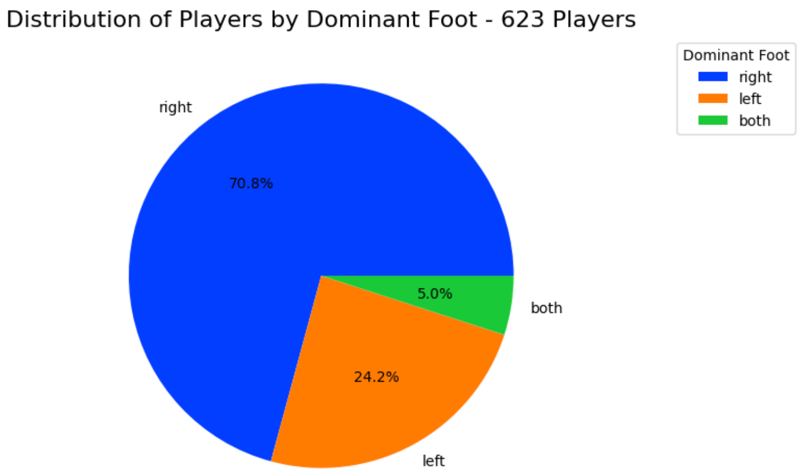
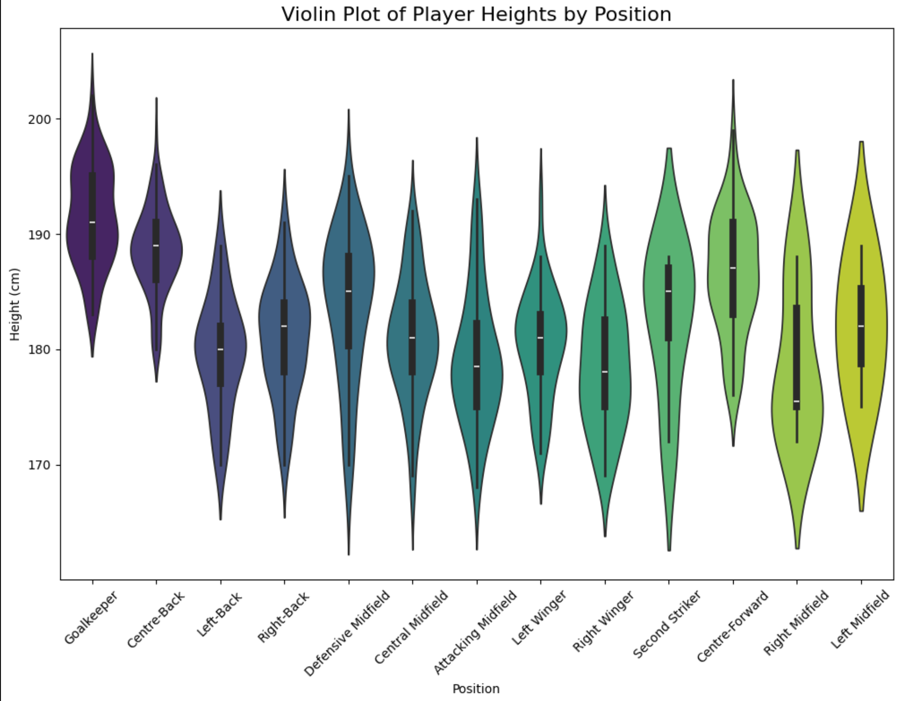
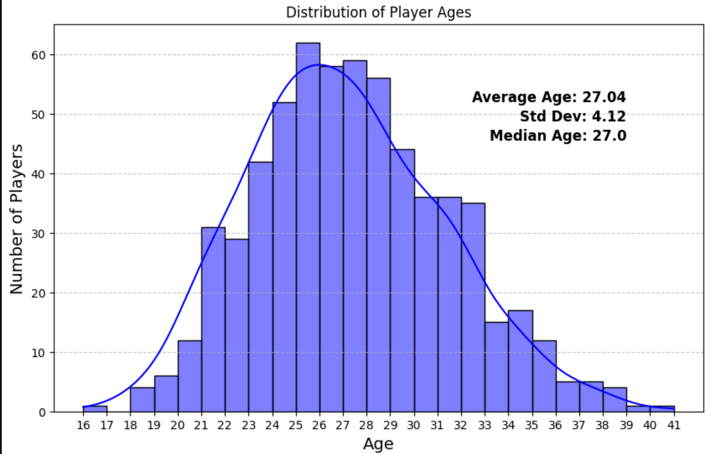
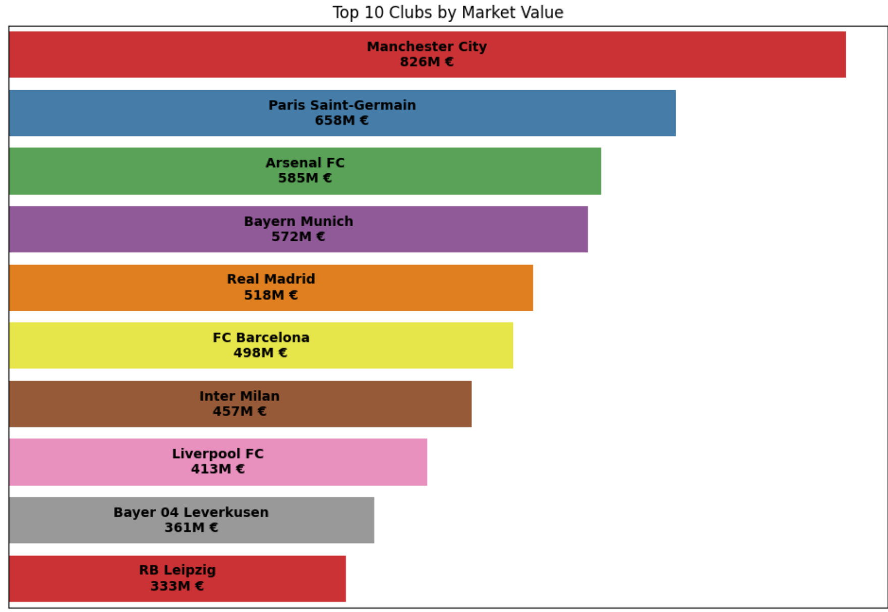
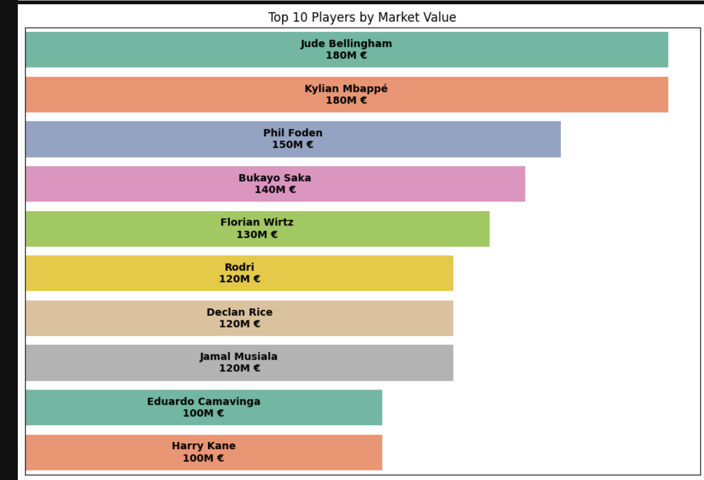
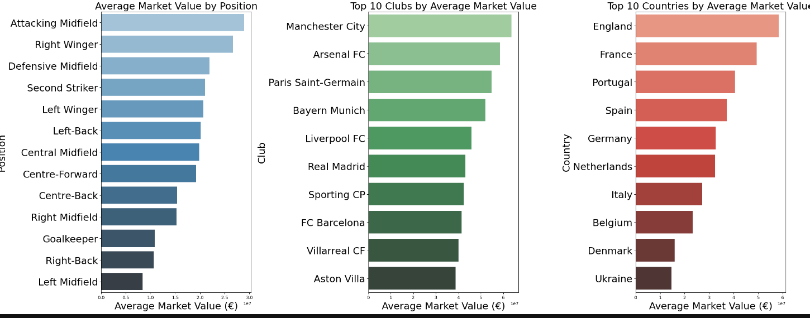
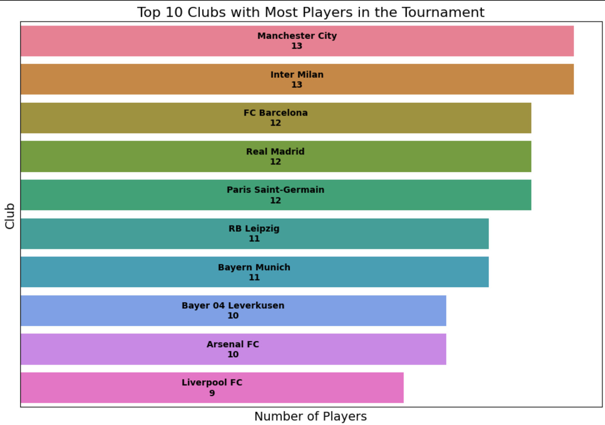
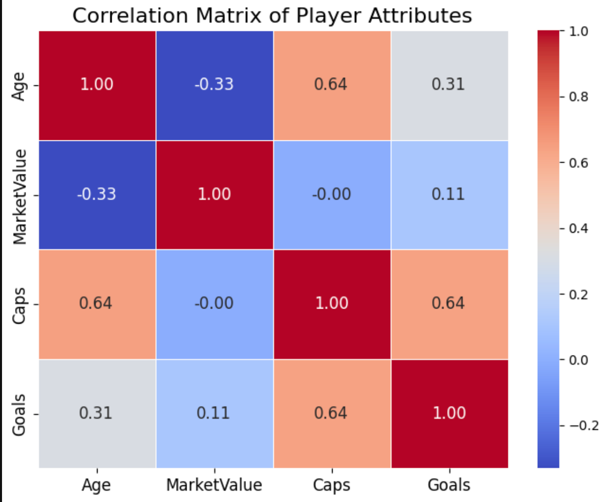

# Euro 2024 Player Analysis

This project involves a comprehensive analysis of the player statistics from the Euro 2024 tournament. The analysis includes various aspects such as player performance, market value, player attributes, and positional data.

## Project Overview

The goal of this project is to analyze the data of players participating in Euro 2024, examining various metrics and attributes. This includes understanding the relationship between the number of caps and goals, distribution of player heights and ages, market values, and much more.

## Data

The data used in this project was sourced from Kaggle and includes a file named `euro2024_players.xlsx` which contains detailed player statistics for the Euro 2024 tournament.

## Analysis and Visualizations

Below are some of the key questions analyzed in this project with corresponding visualizations:

- **Relationship Between Caps and Goals**  
  Analyzing the relationship between the number of appearances (caps) and goals scored by players across different positions.

  

- **Distribution of Players by Dominant Foot**  
  This pie chart shows the distribution of players based on their dominant foot (right, left, or both).

  

- **Violin Plot of Player Heights by Position**  
  The violin plot represents the distribution of player heights across different positions.

  

- **Distribution of Player Ages**  
  This histogram depicts the age distribution of players, with an overlay of the normal distribution curve to illustrate the spread and central tendency.

  

- **Top 10 Clubs by Market Value**  
  A bar chart displaying the top 10 clubs with the highest market value based on the players participating in Euro 2024.

  

- **Top 10 Players by Market Value**  
  This chart shows the top 10 players by market value.

  

- **Average Market Value by Position, Club, and Country**  
  A comparative analysis of the average market value segmented by player position, club, and country.

  

- **Top 10 Clubs with Most Players in the Tournament**  
  Bar chart showing the top 10 clubs with the most players participating in the tournament.

  

- **Correlation Matrix of Player Attributes**  
  A heatmap displaying the correlation between various player attributes like age, market value, caps, and goals.

  

## How to Run

To run the analysis, ensure you have the necessary Python libraries installed:
- pandas
- matplotlib
- seaborn

You can install these using pip:

```bash
pip install pandas matplotlib seaborn
```

## Loading the Data
The data file ```euro2024_players.xlsx``` is included in the repository. To load this data in your Python environment, use the following code snippet:
```python
import pandas as pd

# Load the data
df = pd.read_excel('euro2024_players.xlsx')

# Display the first few rows of the dataframe
print(df.head())
```
